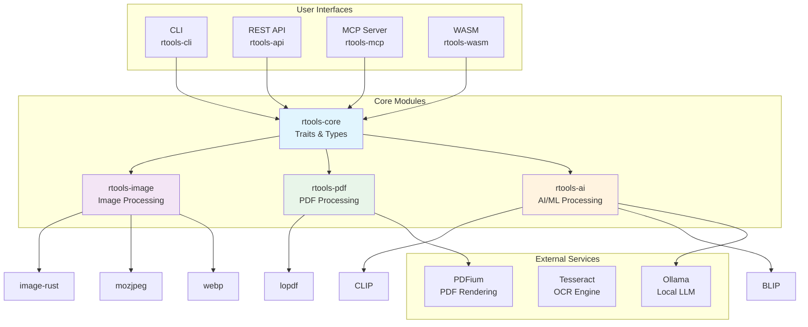
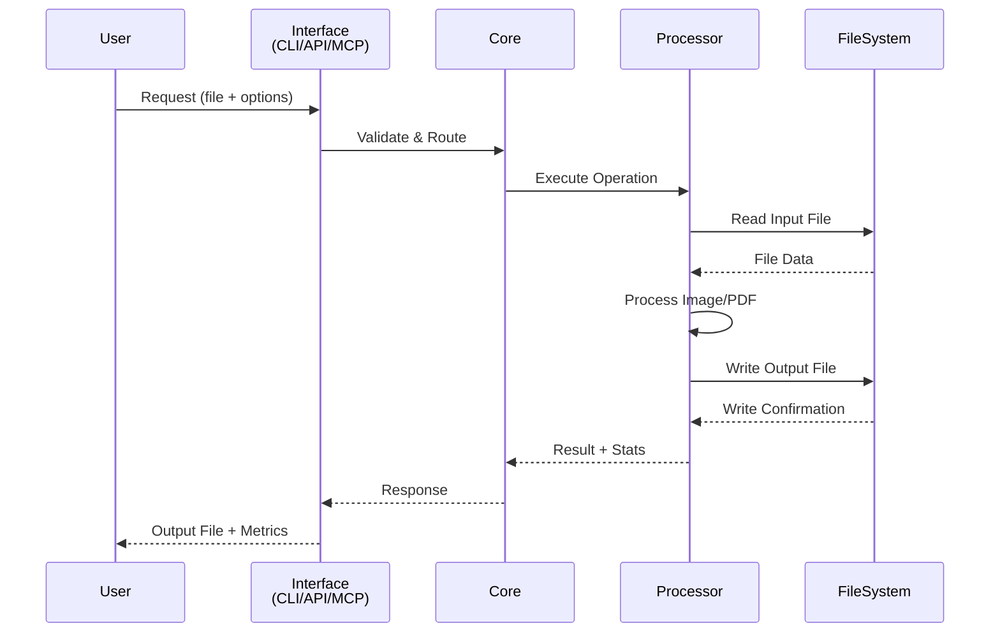

# rtools

A high-performance, privacy-first image and PDF processing toolkit written in Rust.

**Access via CLI, REST API, or MCP (Model Context Protocol)**

[](https://www.rust-lang.org/)
[](LICENSE)

## Features

### Optimize
| Tool | Description |
|------|-------------|
| Compress | Reduce file size without visible quality loss |
| WebP Converter | Convert JPG/PNG to WebP for faster web delivery |
| HEIC Converter | Convert iPhone HEIC photos to JPG or PNG |
| Batch Resize | Resize multiple images by pixel dimensions or percentage |
| Crop & Ratio | Crop to standard aspect ratios or custom dimensions |
| PDF to Image | Extract pages from PDF as high-quality images |

### AI-Powered
| Tool | Description |
|------|-------------|
| AI Organize | Drop 100+ photos — AI sorts them into named folders |
| AI Rename | Generate descriptive, SEO-friendly filenames automatically |
| AI Alt Text | Generate accessibility alt text for any image |
| AI Photo Sort | Sort photos by subject, scene, or custom criteria |
| Transcribe | Extract text from images (OCR) |

### Creative
| Tool | Description |
|------|-------------|
| Film Filters | Apply 14 analog film presets (Kodak, Fuji, Polaroid, etc.) |
| Watermark | Add text or image watermarks with custom positioning |

### Organize
| Tool | Description |
|------|-------------|
| EXIF Viewer | Inspect full metadata — GPS, camera, exposure, timestamps |
| EXIF Remover | Strip GPS and privacy data before sharing |
| Find Duplicates | Detect duplicate images by visual similarity |
| Batch Rename | Rename files in bulk with custom patterns and sequences |

### PDF Processing
| Tool | Description |
|------|-------------|
| Merge PDFs | Combine multiple files into one document |
| Compress PDF | Reduce file sizes by up to 70% |
| Split PDF | Separate into individual pages or extract ranges |
| PDF OCR | Extract text from scanned PDFs |

## Architecture



## Processing Flow



## Installation

### From Source

```bash
# Clone the repository
git clone https://github.com/yourusername/rtools.git
cd rtools

# Build all crates
cargo build --release

# Install CLI
cargo install --path crates/rtools-cli
```

### Using Cargo

```bash
cargo install rtools
```

## Usage

### CLI

```bash
# Compress images
rtools image compress --input photos/ --quality 85

# Convert to WebP
rtools image convert --input *.jpg --format webp

# AI organize photos
rtools ai organize --input ~/Photos --output ~/Organized

# Merge PDFs
rtools pdf merge --input file1.pdf file2.pdf --output merged.pdf
```

### REST API

```bash
# Start the API server
cargo run --bin rtools-api

# Compress an image
curl -X POST http://localhost:8080/api/v1/image/compress \
  -F "file=@photo.jpg" \
  -F "quality=85"

# Get metadata
curl -X POST http://localhost:8080/api/v1/image/metadata \
  -F "file=@photo.jpg"
```

### MCP Integration

```bash
# Start the MCP server
cargo run --bin rtools-mcp

# Configure in Claude Desktop
# Add to claude_desktop_config.json:
{
  "mcpServers": {
    "rtools": {
      "command": "path/to/rtools-mcp"
    }
  }
}
```

### WASM (Browser)

```javascript
import { RTools } from 'rtools-wasm';

const rtools = new RTools();
const compressed = await rtools.compress_image(imageData, 'photo.jpg', 85);
```

## API Endpoints

| Method | Endpoint | Description |
|--------|----------|-------------|
| POST | `/api/v1/image/compress` | Compress image |
| POST | `/api/v1/image/convert` | Convert format |
| POST | `/api/v1/image/resize` | Resize image |
| POST | `/api/v1/image/crop` | Crop image |
| POST | `/api/v1/image/watermark` | Add watermark |
| POST | `/api/v1/image/filter` | Apply film filter |
| POST | `/api/v1/image/metadata` | Get EXIF metadata |
| POST | `/api/v1/pdf/merge` | Merge PDFs |
| POST | `/api/v1/pdf/compress` | Compress PDF |
| POST | `/api/v1/pdf/split` | Split PDF |
| POST | `/api/v1/pdf/ocr` | OCR PDF |
| POST | `/api/v1/ai/organize` | AI organize photos |
| POST | `/api/v1/ai/rename` | AI rename photos |
| POST | `/api/v1/ai/alt-text` | Generate alt text |
| POST | `/api/v1/ai/duplicates` | Find duplicates |
| GET | `/health` | Health check |

## MCP Tools

| Tool | Description |
|------|-------------|
| `compress_image` | Compress an image with quality preservation |
| `convert_image` | Convert image to WebP, PNG, JPG, or AVIF |
| `resize_image` | Resize image by dimensions |
| `organize_photos` | AI-organize photos into folders |
| `rename_photos` | AI-rename photos with descriptive names |
| `generate_alt_text` | Generate accessibility alt text |
| `find_duplicates` | Find duplicate images by visual similarity |
| `compress_pdf` | Compress PDF file size |
| `merge_pdfs` | Merge multiple PDF files |
| `extract_text` | OCR text extraction |
| `get_metadata` | Get image EXIF metadata |

## Configuration

Create `rtools.toml` in your project root:

```toml
[general]
parallel_jobs = 4
temp_dir = "/tmp/rtools"
log_level = "info"

[image]
default_quality = 85
webp_lossless = false
avif_enabled = true
max_dimension = 8192

[pdf]
ocr_language = "eng"
ocr_dpi = 300

[ai]
model_dir = "~/.rtools/models"
device = "cpu"
batch_size = 8

[api]
host = "127.0.0.1"
port = 8080
max_upload_size = "100MB"
```

## Development

```bash
# Run tests
cargo test

# Run benchmarks
cargo bench

# Check clippy
cargo clippy --workspace

# Format code
cargo fmt --all
```

## Project Structure

```
rtools/
├── crates/
│   ├── rtools-core/      # Core traits, types, config
│   ├── rtools-image/     # Image processing operations
│   ├── rtools-pdf/       # PDF processing operations
│   ├── rtools-ai/        # AI/ML integrations
│   ├── rtools-cli/       # CLI interface
│   ├── rtools-api/       # REST API server
│   ├── rtools-mcp/       # MCP server
│   └── rtools-wasm/      # WASM bindings
├── specs/                # Feature specifications
├── tests/                # Integration tests
└── benches/              # Performance benchmarks
```

## License

Licensed under either of:
- MIT license ([LICENSE-MIT](LICENSE-MIT))
- Apache License, Version 2.0 ([LICENSE-APACHE](LICENSE-APACHE))

at your option.

## Contributing

See [CONTRIBUTING.md](CONTRIBUTING.md) for guidelines.