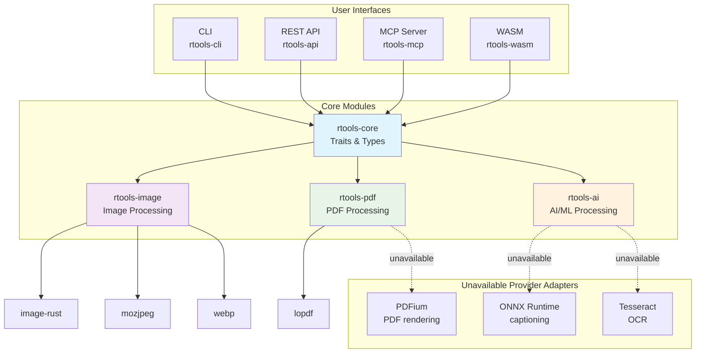
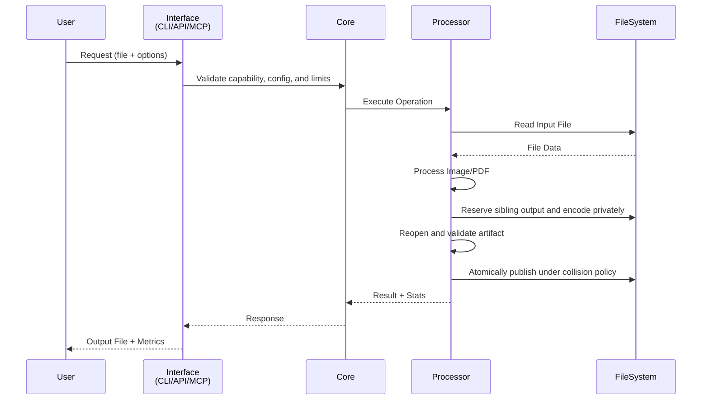

# rtools

A local-first image and PDF processing toolkit written in Rust.

**Access via CLI, REST API, or MCP (Model Context Protocol)**

[](https://www.rust-lang.org/)
[](LICENSE)

## Milestone 1 capability status

The runtime registry, exposed by `rtools --output-format json doctor`, is the
source of truth. The complete, verifier-controlled table is in
[Operation capabilities](docs/operations/capabilities.md).

| State | Operations |
|---|---|
| Available | Image compress, convert, resize, crop, filter, image watermark, EXIF human/JSON inspection; config init/show/validate; shell completions; doctor |
| Experimental | PDF merge/compress/split; report-only duplicate detection; date organization; deterministic rename |
| Unavailable | OCR, alt text, AI classification/naming/sorting, PDF rendering/text/OCR, light/heavy PDF compression, PDF split-to-image, text watermarks, selective metadata preservation/GPS removal, destructive duplicate actions, batch recipes |

Available means supported for the current release. Experimental operations run
but carry the limitation reported by doctor. Unavailable operations fail with
`CAPABILITY_UNAVAILABLE`; rTools does not return placeholder success. Finding
Tesseract, PDFium, or ONNX Runtime is diagnostic information only because no
verified adapter is registered yet.

## Architecture



## Processing Flow



## Installation

### From Source

```bash
# Clone the repository
git clone https://github.com/yourusername/rtools.git
cd rtools

# Build all crates
cargo build --release

# Install CLI
cargo install --path crates/rtools-cli
```

## Usage

### CLI

```bash
# Inspect the runtime truth for this build
rtools --output-format json doctor

# Compress one image; an existing destination is never overwritten by default
rtools image compress --input photo.jpg --output photo-small.jpg --quality 85

# Convert to WebP
rtools image convert --input *.jpg --format webp

# Experimental: deterministic date organization with a truthful no-write plan
rtools --dry-run ai organize --strategy date --input ~/Photos --output ~/Organized

# Experimental: PDF structure preservation is only partially verified
rtools pdf merge --input file1.pdf file2.pdf --output merged.pdf
```

OCR, alt text, PDF rendering, AI-derived naming/classification, text
watermarks, destructive duplicate modes, and `rtools batch` are unavailable.
Invoking a registered unavailable path exits nonzero rather than fabricating an
artifact.

## Safety and reporting contracts

- Output collision policy defaults to `FailIfExists`. The CLI, REST, and MCP
  adapters use that safe default. Rust callers may deliberately select
  `OutputPolicy::UniqueName` or `OutputPolicy::Overwrite`; overwrite is never
  inferred from the presence of an output path.
- Filesystem image outputs and `rtools config init --output` require every
  parent directory to exist already. Create those directories from a trusted
  path before invoking rTools; the writer will not create a missing parent.
  This requirement does not change REST multipart request handling.
- PDF output parents must already exist. The CLI requires an existing explicit
  directory for `pdf split`; Rust callers using `PdfSplitConfig::default()`
  must create its `output/` directory from a trusted path before processing.
- Live date organization requires each derived year/month output directory to
  exist already. Dry-run can be used to obtain the exact planned paths first.
  The REST adapter creates only derived directories below its private,
  server-owned request directory.
- PDF compression currently accepts only `medium`. `light` and `heavy` fail
  with `CAPABILITY_UNAVAILABLE`. PDF split emits PDF pages only; image-output
  settings other than the public defaults fail closed.
- Writing image operations use the verified drop-all metadata policy. Metadata
  preservation and GPS-only removal are unavailable and fail before output
  reservation. EXIF inspection is read-only. The public Rust `quality` fields
  on resize, crop, filter, and watermark currently accept only the legacy
  default `85`; other values return `INVALID_INPUT`. `ConvertConfig::output_dir`
  is unsupported and must remain `None`; use its explicit `output` field.
- `ResourceLimits` defines byte, decoded-pixel, PDF-page, batch-item, and
  duration ceilings. Milestone 1 enforces input-byte and decoded-pixel limits
  on image decode; the other typed ceilings must not be read as claims that an
  unavailable batch or provider-backed operation exists.
- `--output-format json` emits exactly one report on stdout for success,
  partial failure, or failure. `--dry-run` is supported only for experimental
  date organization and deterministic rename; unsupported dry runs fail
  nonzero and create nothing.
- Stable process exits are `0` success, `2` invalid input/format, `3`
  unavailable/config/auth, `4` resource limit, `5` collision/path policy, `6`
  processing/report failure, `7` partial failure, and `8` cancellation/rollback
  failure. See [Stable CLI exit codes](docs/operations/exit-codes.md).

### REST API

```bash
# Start the API server
cargo run --bin rtools-api

# Compress an image
curl -X POST http://localhost:8080/api/v1/image/compress \
  -F "file=@photo.jpg" \
  -F "quality=85"

# Get metadata
curl -X POST http://localhost:8080/api/v1/image/metadata \
  -F "file=@photo.jpg"
```

### MCP Integration

```bash
# Start the MCP server
cargo run --bin rtools-mcp

# Configure in Claude Desktop
# Add to claude_desktop_config.json:
{
  "mcpServers": {
    "rtools": {
      "command": "path/to/rtools-mcp"
    }
  }
}
```

### WASM (Browser)

```javascript
import { RTools } from 'rtools-wasm';

const rtools = new RTools();
const compressed = await rtools.compress_image(imageData, 'photo.jpg', 85);
```

## API Endpoints

| Method | Endpoint | State |
|---|---|---|
| POST | `/api/v1/image/compress` | Available; drop-all metadata |
| POST | `/api/v1/image/convert` | Available; drop-all metadata |
| POST | `/api/v1/image/resize` | Available |
| POST | `/api/v1/image/crop` | REST adapter unavailable; core/CLI operation available |
| POST | `/api/v1/image/watermark` | REST adapter unavailable; core image watermark available |
| POST | `/api/v1/image/filter` | REST adapter unavailable; core/CLI operation available |
| POST | `/api/v1/image/metadata` | Available, read-only |
| POST | `/api/v1/pdf/merge` | Experimental |
| POST | `/api/v1/pdf/compress` | Experimental |
| POST | `/api/v1/pdf/split` | REST adapter unavailable; core/CLI operation experimental |
| POST | `/api/v1/pdf/ocr` | Unavailable |
| POST | `/api/v1/ai/organize` | Date mode experimental; AI modes unavailable |
| POST | `/api/v1/ai/rename` | Deterministic mode experimental; AI naming unavailable |
| POST | `/api/v1/ai/alt-text` | Unavailable |
| POST | `/api/v1/ai/duplicates` | Report mode experimental; mutations unavailable |
| GET | `/health` | Available |

## MCP Tools

| Tool | State |
|---|---|
| `compress_image` | Available; drop-all metadata |
| `convert_image` | Available; drop-all metadata |
| `resize_image` | Available |
| `organize_photos` | Date mode experimental; AI modes unavailable |
| `rename_photos` | Deterministic mode experimental; AI naming unavailable |
| `generate_alt_text` | Unavailable |
| `find_duplicates` | Report mode experimental; mutations unavailable |
| `compress_pdf` | Experimental |
| `merge_pdfs` | Experimental |
| `extract_text` | Unavailable |
| `get_metadata` | Available, read-only |

## Configuration

Create `rtools.toml` in your project root:

```toml
[general]
parallel_jobs = 4
temp_dir = "/tmp/rtools"
log_level = "info"

[image]
default_quality = 85
webp_lossless = false
avif_enabled = true
max_dimension = 8192

[limits]
max_input_bytes = 104857600
max_decoded_pixels = 100000000
max_pdf_pages = 2000
max_batch_items = 10000
max_duration_ms = 300000

[pdf]
ocr_language = "eng"
ocr_dpi = 300

[ai]
model_dir = "/absolute/path/to/models"
device = "Cpu"
batch_size = 8

[api]
host = "127.0.0.1"
port = 8080
max_upload_size = 104857600
```

## Development

```bash
# Release checks
cargo fmt --all -- --check
cargo clippy --workspace --all-targets --locked -- -D warnings
cargo test --workspace --all-targets --locked
cargo check -p rtools-wasm --target wasm32-unknown-unknown --locked
cargo deny check
bash scripts/verify-capabilities.sh
```

## Project Structure

```
rtools/
├── crates/
│   ├── rtools-core/      # Core traits, types, config
│   ├── rtools-image/     # Image processing operations
│   ├── rtools-pdf/       # PDF processing operations
│   ├── rtools-ai/        # AI/ML integrations
│   ├── rtools-cli/       # CLI interface
│   ├── rtools-api/       # REST API server
│   ├── rtools-mcp/       # MCP server
│   └── rtools-wasm/      # WASM bindings
├── specs/                # Feature specifications
├── tests/                # Integration tests
└── benches/              # Performance benchmarks
```

## License

Licensed under either of:
- MIT license ([LICENSE-MIT](LICENSE-MIT))
- Apache License, Version 2.0 ([LICENSE-APACHE](LICENSE-APACHE))

at your option.

## Contributing

See [CONTRIBUTING.md](CONTRIBUTING.md) for guidelines.
