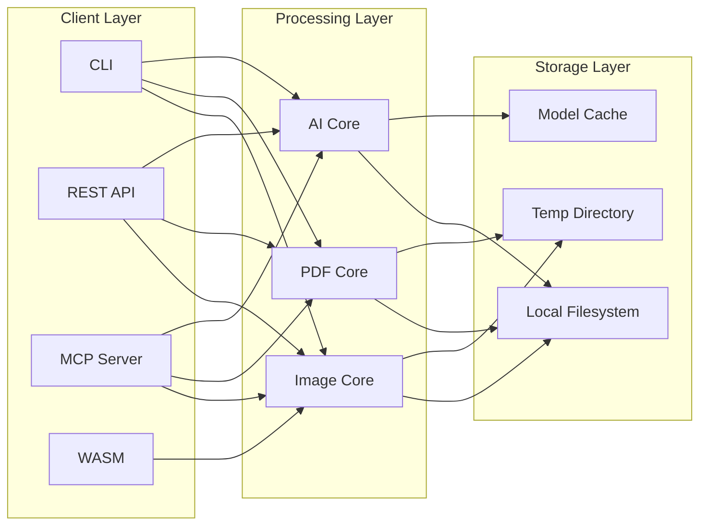
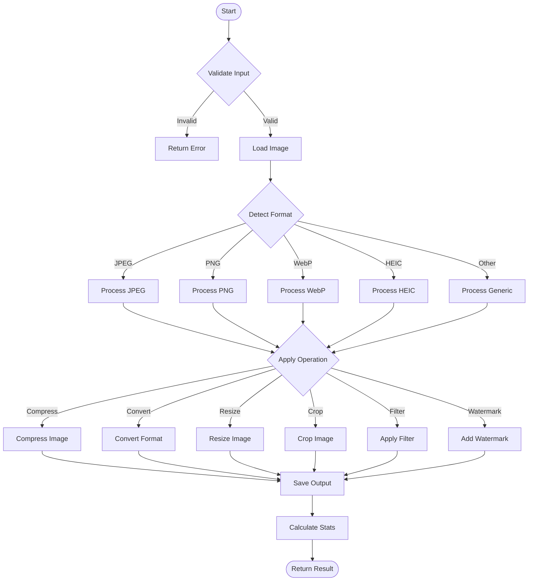
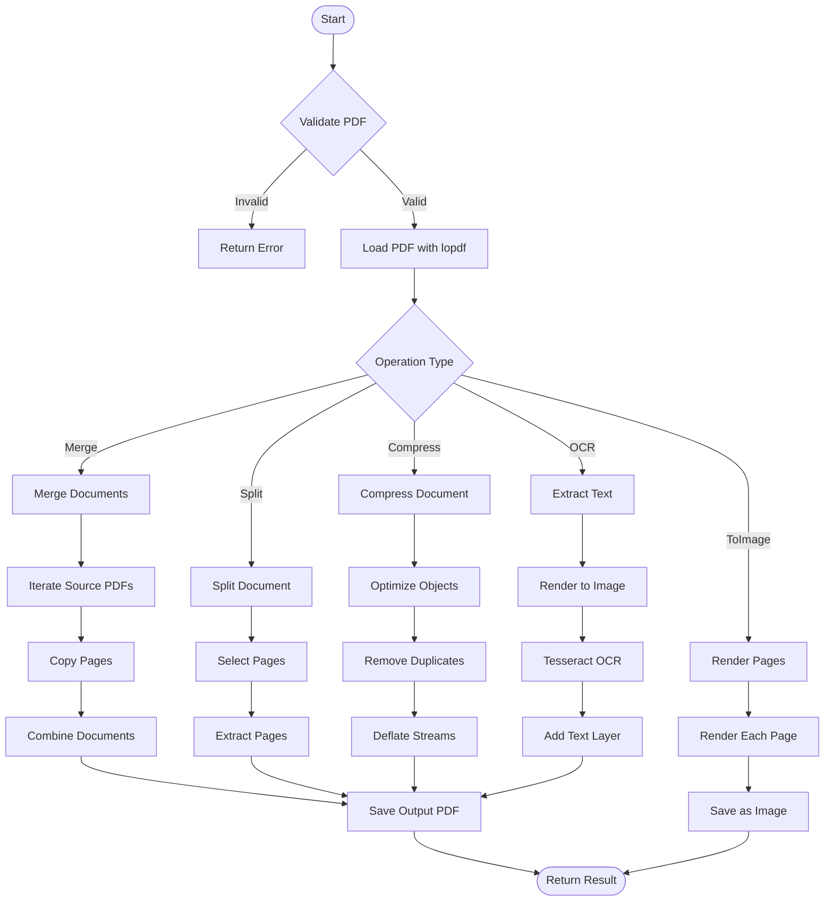
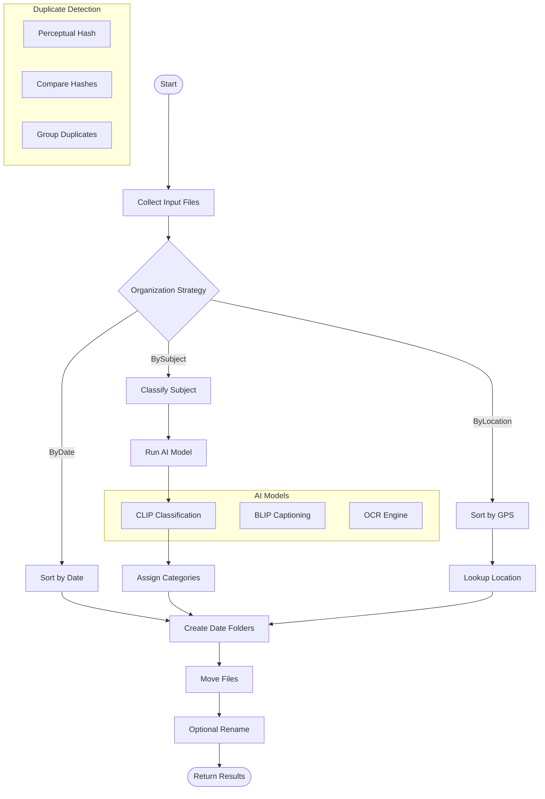
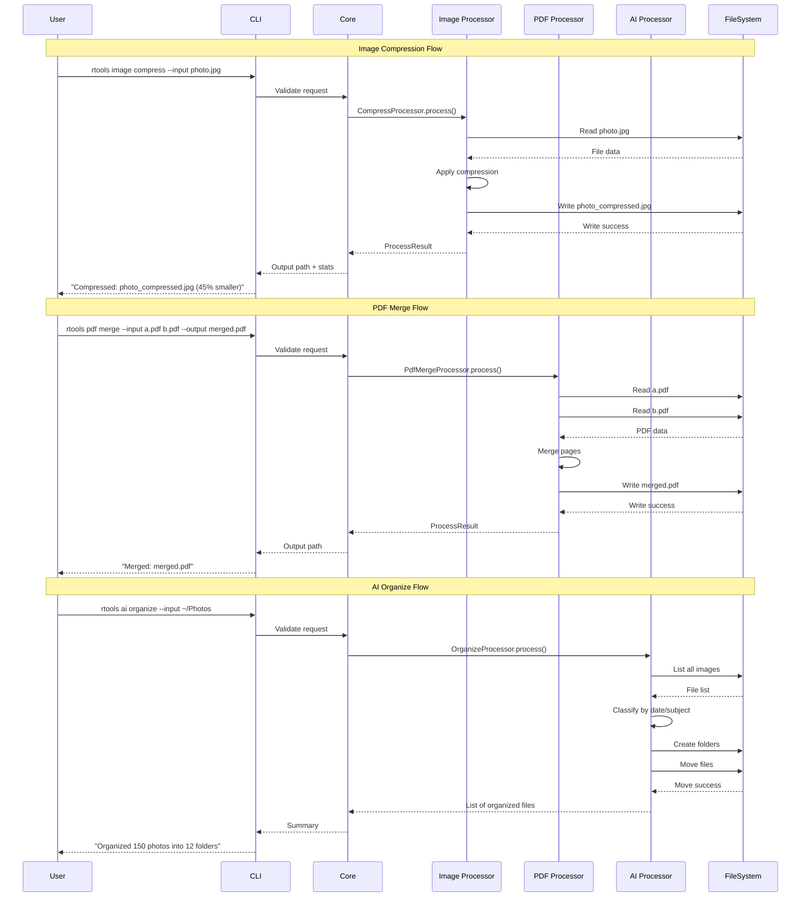
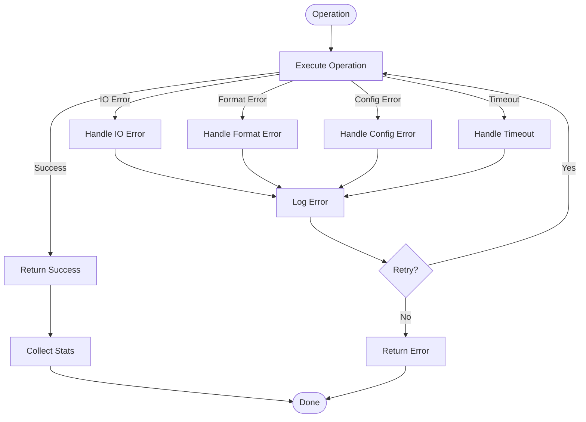
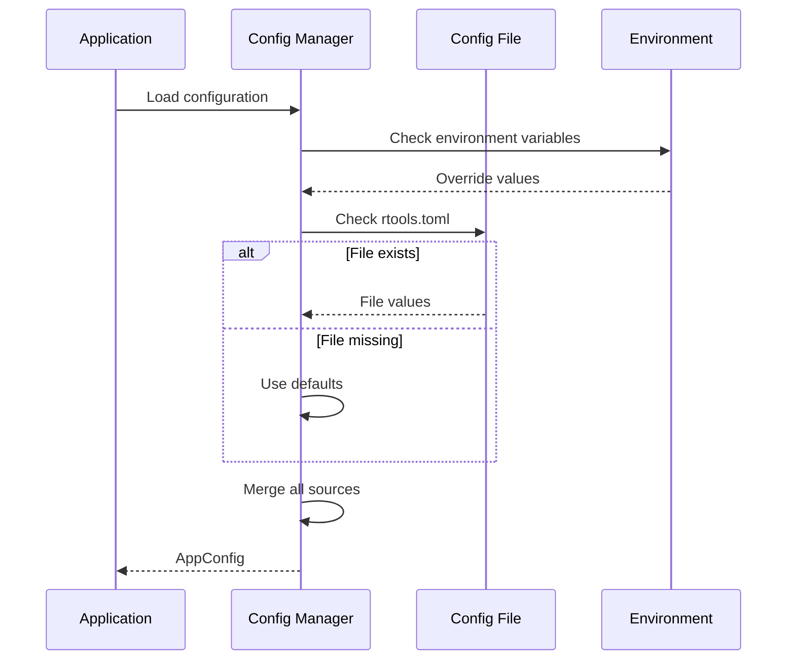
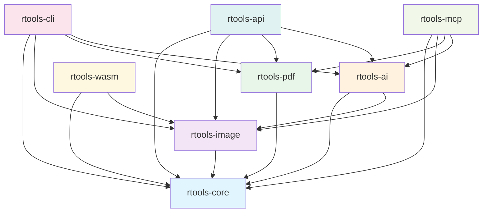

# Architecture

## System Overview

## Image Processing Pipeline

## PDF Processing Pipeline

## AI Processing Pipeline

## Data Flow Diagram

## Error Handling Flow

## Configuration Flow

## Module Dependencies

