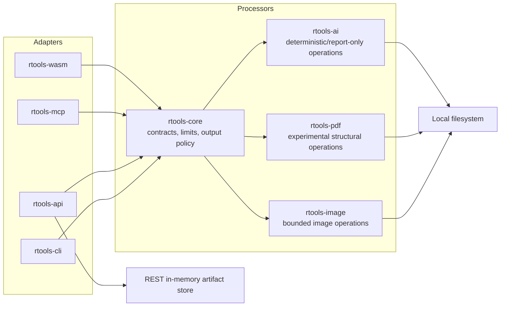
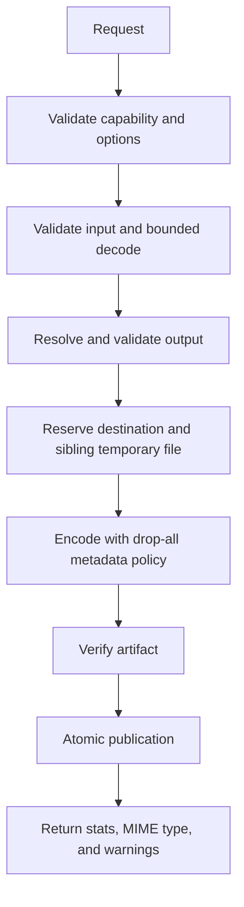
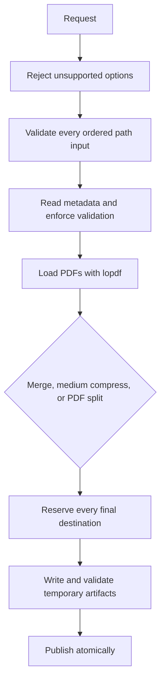
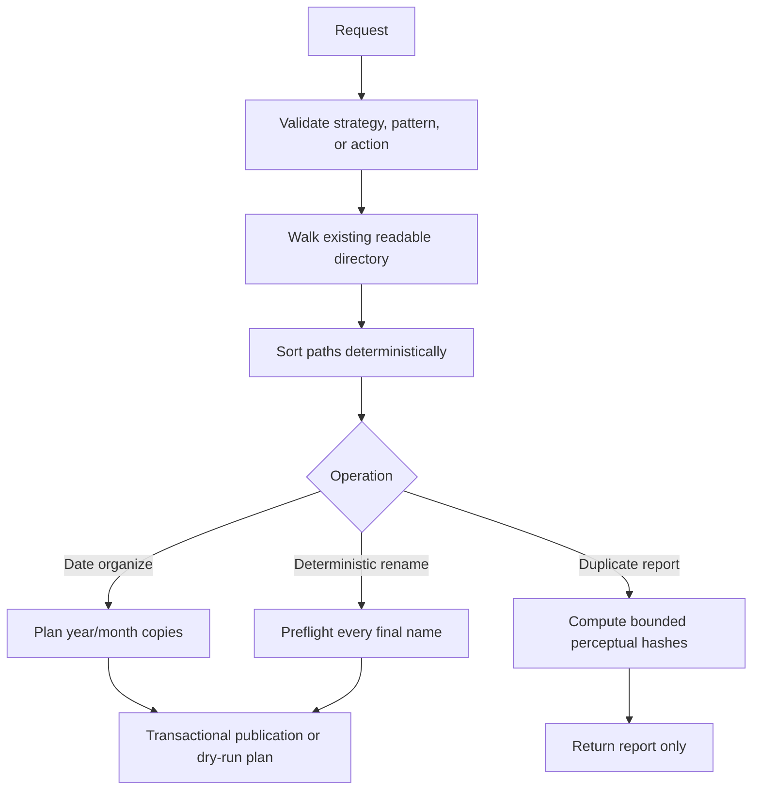
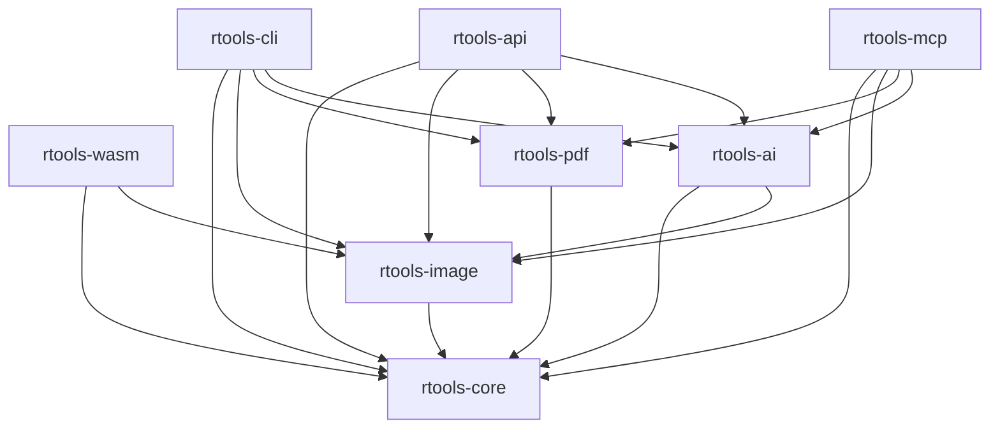

# Milestone 1 architecture

This document describes the current executable build. Roadmap components are
kept in [SPEC.md](../SPEC.md) and are not part of this architecture until a
verified adapter is registered in the runtime capability registry.

## Runtime boundaries

- `rtools-core` defines processor contracts, stable errors, resource limits,
  configuration, path validation, collision policy, temporary reservations,
  and atomic publication.
- CLI, REST, and MCP translate public parameters into those processor types.
  They do not enable unavailable behavior by silently changing an option.
- REST uploads live in request-owned temporary storage. Successful REST files
  are copied into an in-memory artifact store and returned by opaque artifact
  ID. There is no durable retention guarantee.
- MCP operates on server-local paths, but public results and errors do not
  expose host filesystem paths. It has no hosted-download contract.

## Image write path

Executable image operations are compress, convert, resize, crop, supported
filters, image watermarking, and read-only EXIF inspection. JPEG quality is
1 through 100. Text watermarking, OCR, metadata preservation, and selective
GPS removal fail closed before output reservation.

## PDF write path

PDF merge, medium compression, and PDF-page splitting are experimental because
structural fidelity has not been fully verified. Output parents must already
exist and cannot traverse symlink ancestors. Merge page numbering, light/heavy
compression, PDF-to-image, text extraction, and PDF OCR are unavailable.

## Deterministic organization and duplicate reporting

Only date organization, deterministic rename tokens, and report-only duplicate
detection execute. Subject/location/camera/custom organization, AI-derived
rename tokens, alt text, OCR, sorting, and destructive duplicate actions are
unavailable. No model cache, model download, CLIP, BLIP, Tesseract, ONNX, or
geocoding pipeline exists in Milestone 1.

## Capability and adapter verification

`rtools --output-format json doctor` exports the operation registry.
`rtools-mcp --print-contracts` exports the MCP tool-to-operation contract that
also drives live `tools/list`. The Bash and PowerShell verification scripts
compare both runtime exports with their checked-in documentation, reject
duplicates, and run the structured adapter behavior matrix.

## Module dependencies

Authentication, TLS termination, background jobs, batch execution, provider
model management, and durable artifact retention are outside the current
runtime boundary.
